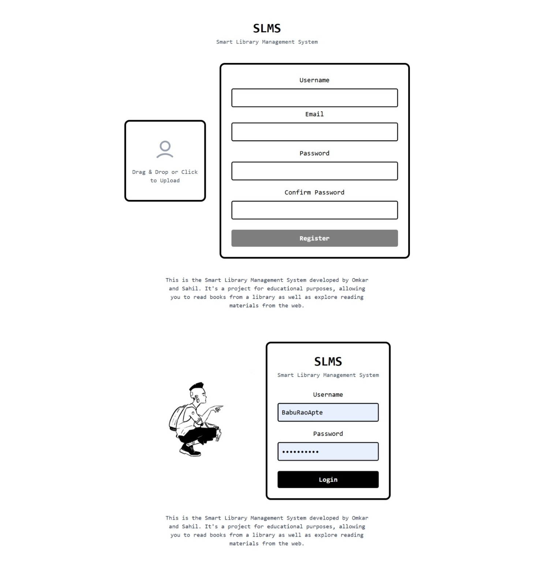

# Smart Library Management System (SLMS)

This is the **Smart Library Management System** developed by Omkar and Sahil.  
It's an educational project that allows users to:

- Read books from a library collection
- Explore reading materials from the web

---

## Screenshot



---

## Project Structure

- `backend/` — Django REST API backend  
- `frontend/` — React/Vite frontend application

---

## How to Run Locally

1. Clone the repo  
   ```bash
   git clone https://github.com/SahilKaturde/SLMS.git
   cd SLMS
